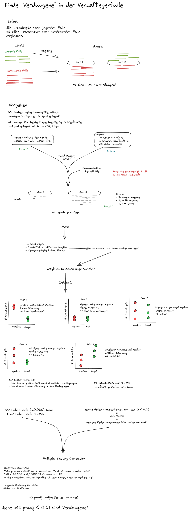

# Bioinformatics Master

## Goal

This repository contains additional material for the introductory Bioinformatics course taught as part of the Master Life Sciences at the university of Würzburg. In this course, you will identify genes which are up-regulated in a digesting Venus Flytrap Trap and characterize their function and evolution. To reach this goal, you will learn how to work on a remote linux machine and apply a typical RNASeq workflow. We will use RNASeq data from [Bemm et al.](https://genome.cshlp.org/content/26/6/812.full.html) and the genome published in [Palvalfi et al.](https://www.sciencedirect.com/science/article/pii/S0960982220305674)

[Linux Basics](./LinuxBasics.md)

[RNASeq Analysis](./RNASeqAnalysis.md)

<!--
links
grep, sort, uniq: check
pipes : check
cluster setup, SLURM (idea of)
-->